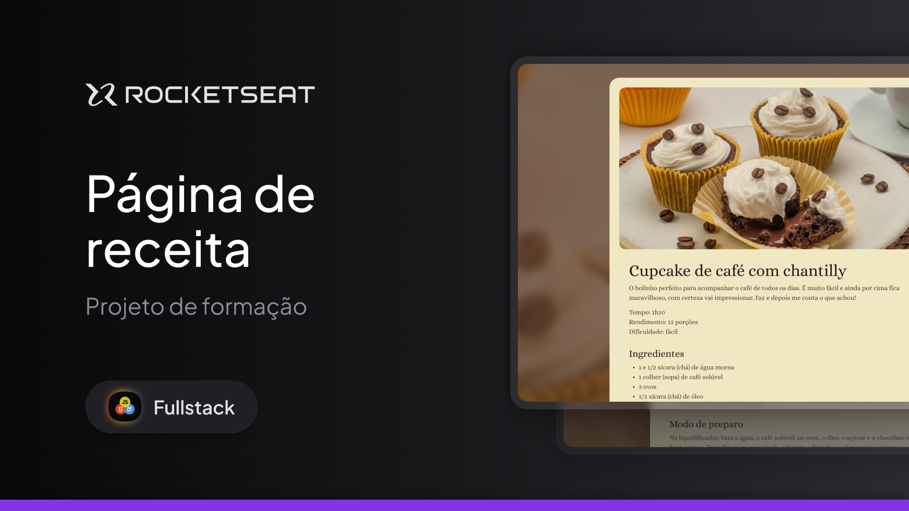

### Página de Receitas - Cupcake de Café com Chantilly

Uma página estática simples e charmosa desenvolvida com HTML e CSS para apresentar uma deliciosa receita de cupcake de café com chantilly. Ideal para quem está aprendendo ou deseja praticar a criação de páginas web com foco em layout e estruturação de conteúdo.

Projeto de uma página de receita desenvolvido durante as aulas sobre **Fundamentos do HTML e CSS** na Rocketseat.

---

### 📋 Descrição

Este projeto é uma landing page de receita culinária que apresenta:

- **Imagem ilustrativa do prato**
- **Descrição da receita**
- **Ingredientes organizados em lista**
- **Modo de preparo passo a passo**
- **Rodapé com assinatura**

---

### 🛠️ Tecnologias Utilizadas

- **HTML**
- **CSS**
